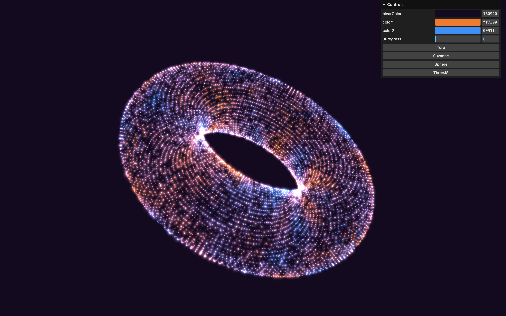

# ✨ Three.js – Morphing de particules 🔁

Une scène 3D interactive faisant morpher un nuage de particules entre plusieurs formes (tore, Suzanne, sphère, logo Three.js), avec une transition pilotée par du bruit simplex et animée via GSAP, réalisée avec [Three.js](https://threejs.org/) et des shaders GLSL personnalisés. Projet inspiré du parcours Three.js Journey par Bruno Simon.



## 🚀 Démo

[Voir la démo](https://rekuiem84.github.io/particles-morphing-shader/)

## ✨ Fonctionnalités

- Chargement d'un modèle `.glb` contenant plusieurs géométries (tore, Suzanne, sphère, logo Three.js) utilisées comme cibles de morphing
- Génération d'un nuage de particules, complété automatiquement pour atteindre le nombre maximal de vertices parmi tous les modèles
- Morphing animé entre les formes via GSAP, chaque particule démarrant sa transition avec un délai propre calculé à partir d'un bruit simplex 3D (effet de dispersion organique plutôt qu'un morph uniforme)
- Interpolation de couleur entre deux teintes réglables, basée sur ce même bruit simplex

## 🛠️ Installation & Lancement

1. **Cloner le dépôt :**
   ```bash
   git clone https://github.com/Rekuiem84/particles-morphing-shader
   cd particles-morphing-shader
   ```
2. **Installer les dépendances :**
   ```bash
   npm install
   ```
3. **Lancer le serveur de développement :**
   ```bash
   npm run dev
   ```
4. **Build pour la production :**
   ```bash
   npm run build
   ```
   Les fichiers optimisés seront générés dans le dossier `dist/`.

## 📁 Structure du projet

```
├── src/
│   ├── script.js
│   └── shaders/
│       └── particles/
│           ├── fragment.glsl
│           └── vertex.glsl
│       └── includes/
│           └── simplexNoise3d.glsl
├── static/
│   └── models.glb
```

## 🎛️ Paramètres ajustables (via le menu debug)

`clearColor` : couleur de fond de la scène
`color1` / `color2` : couleurs entre lesquelles les particules sont interpolées
`uProgress` : valeur de progression du morph en cours
`Tore` / `Suzanne` / `Sphere` / `ThreeJS` : boutons déclenchant le morph vers la forme correspondante

## 🔗 Mes autres projets Three.js

- [Repo Three.js Journey principal](https://github.com/Rekuiem84/threejs-journey) — pour retrouver tous mes projets suivant ce parcours
